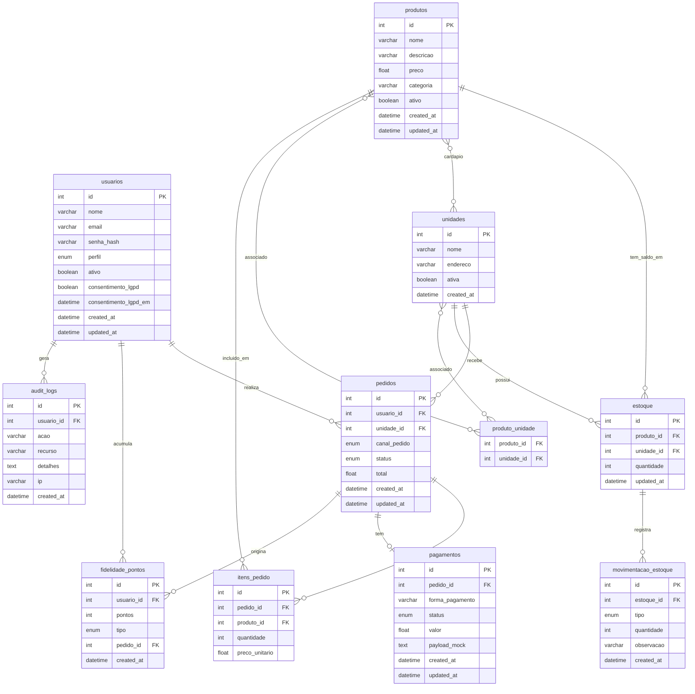

# DER — Diagrama Entidade-Relacionamento
## Rede "Raízes do Nordeste"

## Cardinalidades e restrições

| Relacionamento | Regra |
|---|---|
| `usuarios` → `pedidos` | Um usuário pode ter muitos pedidos |
| `unidades` → `estoque` | Cada unidade possui estoque próprio por produto |
| `produtos` ↔ `unidades` | Cardápio por unidade (N:N via `produto_unidade`) |
| `pedidos` → `pagamentos` | Cada pedido tem exatamente 1 pagamento (unique constraint) |
| `pedidos` → `itens_pedido` | Um pedido contém 1 ou mais itens |
| `estoque` → `movimentacao_estoque` | Toda entrada/saída é registrada para auditoria |
| `pedidos` → `fidelidade_pontos` | Pontos acumulados por pedido aprovado |

## ENUMs

| Tabela | Campo | Valores |
|---|---|---|
| `usuarios` | `perfil` | CLIENTE, ATENDENTE, COZINHA, GERENTE, ADMIN |
| `pedidos` | `canal_pedido` | APP, TOTEM, BALCAO, PICKUP, WEB |
| `pedidos` | `status` | AGUARDANDO_PAGAMENTO, PAGAMENTO_RECUSADO, EM_PREPARO, PRONTO, ENTREGUE, CANCELADO |
| `pagamentos` | `status` | AGUARDANDO, APROVADO, RECUSADO |
| `movimentacao_estoque` | `tipo` | ENTRADA, SAIDA |
| `fidelidade_pontos` | `tipo` | ACUMULO, RESGATE |
